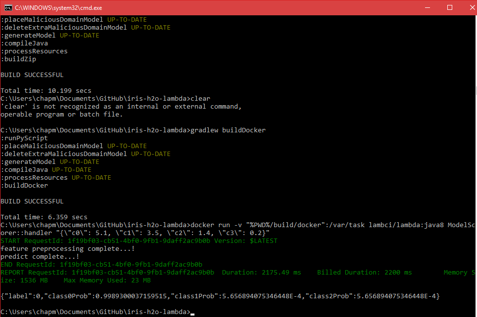

# Readme

Ensure that `JAVA_HOME` is set to run `gradle` correctly.

```
gradlew wrapper
gradlew buildZip
gradlew buildDocker
```

Usage as Java Object
--------------------

```
gradlew run
```

This will verify that the main method can be called and therefore can be integrated into any Java program as required. The main class should always be in the form:

```java
RequestClass request = new RequestClass(...);
prediction(request);
```

Testing using `docker-lambda`
-----------------------------

Run `buildDocker` so that we can run using `docker-lambda`

```
set PWD=<path>
docker run -v "%PWD%/build/docker":/var/task lambci/lambda:java8 ModelScorer::handler "{\"c0\": 5.1, \"c1\": 3.5, \"c2\": 1.4, \"c3\": 0.2}"
```

Framework
---------

Realtime scoring using AWS Lambda. This allows building simple pipelines when constrained to basic Python operations only. The source code is as follows:

*  `src/main/java/ModelScorer.java`: handles the payload from AWS. In the ideal world, this is generally untouched - the data scientist would only touch the `feature_preprocessing` and `decision_engine` scripts.
*  `src/main/java/irisModel.java`: the automatically generated POJO file from H2O. This file has been generated off the Jupyter notebook in this repository
*  `src/main/resources/pipeline.py`: this executes the scoring pipeline - should generally be untouched
*  `src/main/resources/feature_preprocessing.py`: this file is for any feature preprocessing which was completed before being scored by h2o
*  `src/main/resources/decision_engine.py`: this file is for modifying the output of the scoring object before it is sent to the outbound payload. This could include threshold adjustments, alert text, rules override etc.

Proposed Workflow
-----------------

If there is no change the payload interface, the process for updating models should be:

*  Modify `feature_preprocessing`, `decision_engine` functions as needed. Rely on automatically generated POJO files for the H2O modelling portion
*  Package up the solution using `gradlew buildDocker` and test using `docker-lambda` (with a suite of tests?)
*  If passes all relevant tests, bundle and deploy using `gradlew buildZip`



